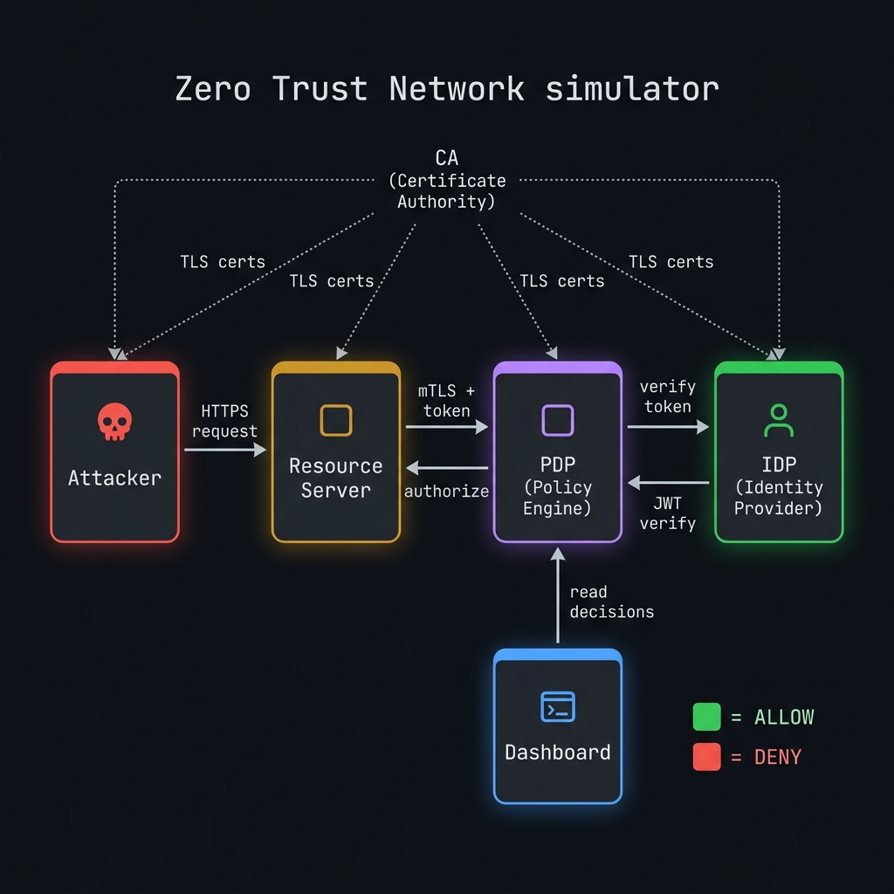
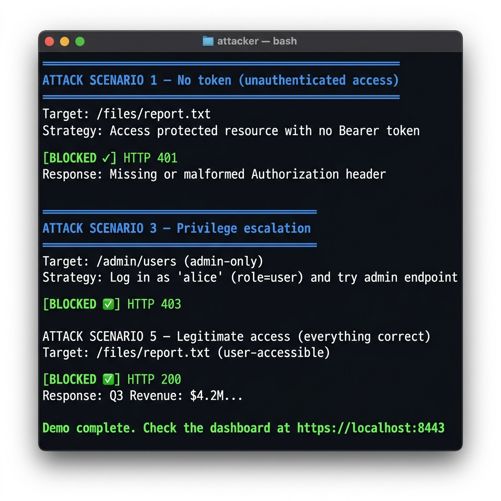

<div align="center">

# 🛡️ Zero Trust Network Simulator

**A fully containerized microservices lab that demonstrates Zero Trust Architecture principles — where nothing is trusted and everything is verified.**

[](https://python.org)
[](https://flask.palletsprojects.com)
[](https://docs.docker.com/compose/)
[](LICENSE)

<br>



<br>

*Every request is authenticated, authorized, and encrypted — no implicit trust, ever.*

</div>

---

## 📋 Table of Contents

- [Overview](#-overview)
- [Architecture](#-architecture)
- [Features](#-features)
- [Quick Start](#-quick-start)
- [Attack Scenarios](#-attack-scenarios)
- [Dashboard](#-dashboard)
- [Project Structure](#-project-structure)
- [How It Works](#-how-it-works)
- [Configuration](#-configuration)
- [Contributing](#-contributing)
- [License](#-license)

---

## 🔍 Overview

This simulator implements a **Zero Trust Architecture (ZTA)** as described by [NIST SP 800-207](https://csrc.nist.gov/publications/detail/sp/800-207/final). It demonstrates core security principles through 5 interconnected microservices running in Docker containers:

> **"Never trust, always verify"** — Every access request is fully authenticated, authorized, and encrypted before granting access to resources, regardless of origin.

The project ships with an **automated attacker** that runs 5 progressively sophisticated attack scenarios, showing exactly how Zero Trust policies block unauthorized access while allowing legitimate users through.

---

## 🏗️ Architecture

```
                        ┌──────────────────────┐
                        │    CA (Certificate    │
                        │      Authority)       │
                        └──────────┬───────────┘
                     TLS certs to all services
                                   │
     ┌─────────┐  HTTPS   ┌───────┴──────┐  mTLS    ┌──────────┐  JWT verify  ┌──────────┐
     │ Attacker ├─────────►│   Resource   ├─────────►│   PDP    ├─────────────►│   IDP    │
     │          │          │   Server     │◄─────────│ (Policy) │              │(Identity)│
     └─────────┘          │  :5002       │ authorize │  :5001   │              │  :5000   │
                          └──────────────┘          └─────┬────┘              └──────────┘
                                                          │
                                                   read decisions
                                                          │
                                                    ┌─────┴────┐
                                                    │Dashboard │
                                                    │  :8443   │
                                                    └──────────┘
```

| Service | Role | Port |
|---------|------|------|
| **IDP** (Identity Provider) | Issues short-lived RS256 JWT tokens upon login | `5000` |
| **PDP** (Policy Decision Point) | Evaluates every access request against policies | `5001` |
| **Resource Server** | Protects files & admin endpoints; delegates auth to PDP | `5002` |
| **Dashboard** | Real-time monitoring UI showing all policy decisions | `8443` |
| **Attacker** | Automated red-team simulation running 5 attack scenarios | — |

---

## ✨ Features

### 🔐 Security Mechanisms
- **TLS Everywhere** — All inter-service communication encrypted via CA-signed certificates
- **Mutual TLS (mTLS)** — PDP requires client certificates; the attacker (with no service cert) cannot directly communicate with it
- **RS256 JWT Tokens** — Short-lived (5 min), cryptographically signed with asymmetric keys
- **Per-Request Authorization** — Every single request is verified by the PDP; nothing is cached or assumed
- **Role-Based Access Control (RBAC)** — Policies define which roles can access which resources

### 📊 Observability
- **Real-time Dashboard** — Live policy decision log with service health monitoring
- **Decision Audit Trail** — Every allow/deny stored in SQLite with timestamp, user, role, resource, and reason
- **Service Health Checks** — Dashboard polls all services for liveness status

### 🎯 Attack Simulation
- 5 automated attack scenarios covering common Zero Trust bypass attempts
- Color-coded terminal output showing blocked vs. allowed results
- All decisions visible in the dashboard after the attack run

---

## 🚀 Quick Start

### Prerequisites

- [Docker](https://docs.docker.com/get-docker/) (v20+)
- [Docker Compose](https://docs.docker.com/compose/install/) (v2+)
- `openssl` (for certificate generation)

### 1. Clone the Repository

```bash
git clone https://github.com/Yashchhelavada/Zero-trust-simulator.git
cd Zero-trust-simulator
```

### 2. Generate Certificates

```bash
chmod +x gen-certs.sh
bash gen-certs.sh
```

This creates a private CA and signs TLS + JWT certificates for all services.

### 3. Build & Start Services

```bash
sudo docker compose build
sudo docker compose up -d
```

### 4. Run the Attack Simulation

```bash
sudo docker compose up attacker
```

### 5. Open the Dashboard

Navigate to **[https://localhost:8443](https://localhost:8443)** in your browser.

> ⚠️ **Note:** You'll see a browser warning because the certificate is signed by a private CA. Click **"Advanced" → "Accept the Risk"** to proceed.

---

## ⚔️ Attack Scenarios

The attacker container runs 5 scenarios that demonstrate Zero Trust defenses:

<div align="center">

</div>

<br>

| # | Scenario | Strategy | Expected Result |
|---|----------|----------|-----------------|
| 1 | **No Token** | Access resource with no `Authorization` header | 🔴 `401` Blocked |
| 2 | **Expired Token** | Replay a hardcoded expired JWT | 🔴 `403` Blocked |
| 3 | **Privilege Escalation** | User role (`alice`) attempts admin-only endpoint | 🔴 `403` Blocked |
| 4 | **Forged Token** | Tamper with JWT payload, break signature | 🔴 `403` Blocked |
| 5 | **Legitimate Access** | Valid user token accessing permitted resource | 🟢 `200` Allowed |

> All 5 scenarios demonstrate that the Zero Trust model correctly enforces **"deny by default"** — only the legitimate request with proper credentials and permissions succeeds.

---

## 📊 Dashboard

The dashboard provides a real-time security operations view:

- **Stats Bar** — Total decisions, allowed count, denied count, and allow rate percentage
- **Service Health** — Live status indicators for IDP, PDP, Resource Server, and Dashboard
- **Decision Log** — Scrollable table showing every policy decision with timestamp, user, role, resource, method, decision (ALLOW/DENY), and reason
- **Auto-Refresh** — Updates every 3 seconds

---

## 📁 Project Structure

```
zero-trust-simulator/
├── 📄 docker-compose.yml       # Service orchestration
├── 🔑 gen-certs.sh             # Certificate generation (CA + service certs + JWT keys)
├── 🔐 certs/                   # Generated certificates (gitignored)
│   ├── ca.crt / ca.key         # Certificate Authority
│   ├── jwt_private.key         # JWT signing key (IDP only)
│   ├── jwt_public.key          # JWT verification key (IDP + PDP)
│   ├── idp.crt / idp.key       # IDP TLS certificate
│   ├── pdp.crt / pdp.key       # PDP TLS certificate
│   ├── resource.crt / .key     # Resource server TLS certificate
│   └── dashboard.crt / .key    # Dashboard TLS certificate
│
├── 🟢 idp/                     # Identity Provider
│   ├── Dockerfile
│   ├── app.py                  # Login, token issuance, verification
│   └── requirements.txt
│
├── 🟣 pdp/                     # Policy Decision Point
│   ├── Dockerfile
│   ├── app.py                  # Authorization engine + decision logging
│   ├── policies.json           # RBAC policy definitions
│   └── requirements.txt
│
├── 🟠 resource/                # Resource Server
│   ├── Dockerfile
│   ├── app.py                  # Protected files & admin endpoints
│   └── requirements.txt
│
├── 🔵 dashboard/               # Security Dashboard
│   ├── Dockerfile
│   ├── app.py                  # Stats API + health checks
│   ├── requirements.txt
│   └── templates/
│       └── index.html          # Real-time monitoring UI
│
├── 🔴 attacker/                # Red Team Simulator
│   ├── Dockerfile
│   └── attack.py               # 5 automated attack scenarios
│
├── 📁 data/                    # Shared volume for SQLite decisions DB
└── 📁 docs/                    # Documentation assets
    ├── architecture.png
    └── attacker-demo.png
```

---

## ⚙️ How It Works

### Authentication Flow

```
User (login) ──► IDP ──► Issues RS256 JWT (5 min TTL)
                          Contains: sub, role, mfa, iat, exp, iss
```

### Authorization Flow (every request)

```
Client ──► Resource Server ──► PDP ──► Decision (ALLOW / DENY)
              │                  │
              │ Extracts Bearer  │ 1. Verifies JWT signature (RS256)
              │ token from       │ 2. Checks token expiration
              │ Authorization    │ 3. Matches resource to policy
              │ header           │ 4. Validates role ∈ required_roles
              │                  │ 5. Logs decision to SQLite
              │◄─────────────────│
              │ Serves resource  │
              │ OR returns 403   │
```

### Test Users

| Username | Password | Role | MFA |
|----------|----------|------|-----|
| `alice` | `alice123` | `user` | ✅ |
| `bob` | `bob123` | `admin` | ✅ |
| `charlie` | `charlie123` | `user` | ❌ |

### Policies

| ID | Resource | Methods | Required Roles |
|----|----------|---------|----------------|
| `p1` | `/files/report.txt` | GET | `user`, `admin` |
| `p2` | `/files/secret.txt` | GET | `admin` |
| `p3` | `/admin/users` | GET, POST, DELETE | `admin` |
| `p4` | `/files/public.txt` | GET | `user`, `admin` |

---

## 🔧 Configuration

### Adding New Policies

Edit `pdp/policies.json`:

```json
{
  "id": "p5",
  "resource": "/files/newfile.txt",
  "methods": ["GET"],
  "required_roles": ["admin"],
  "description": "Only admins can access the new file"
}
```

### Adding New Users

Edit `idp/app.py`:

```python
USERS = {
    "alice":   {"password": "alice123",   "role": "user",  "mfa": True},
    "bob":     {"password": "bob123",     "role": "admin", "mfa": True},
    "newuser": {"password": "pass123",    "role": "user",  "mfa": False},
}
```

### Regenerating Certificates

```bash
bash gen-certs.sh
sudo docker compose down
sudo docker compose up -d
```

---

## 🤝 Contributing

Contributions are welcome! Here are some ideas:

- [ ] Add **MFA enforcement** in the PDP (check the `mfa` claim)
- [ ] Implement **rate limiting** to detect brute-force attacks
- [ ] Add **network segmentation** policies
- [ ] Create a **Kubernetes** deployment manifest
- [ ] Add **SIEM integration** (forward decisions to Elasticsearch/Splunk)
- [ ] Implement **device trust scoring**

```bash
# Fork & clone
git checkout -b feature/your-feature
# Make changes
git commit -m "Add your feature"
git push origin feature/your-feature
# Open a Pull Request
```

---

## 📜 License

This project is licensed under the MIT License — see the [LICENSE](LICENSE) file for details.

---

<div align="center">

**Built with 🔒 to demonstrate that trust must be earned, not assumed.**

*If you found this useful, consider giving it a ⭐*

</div>
